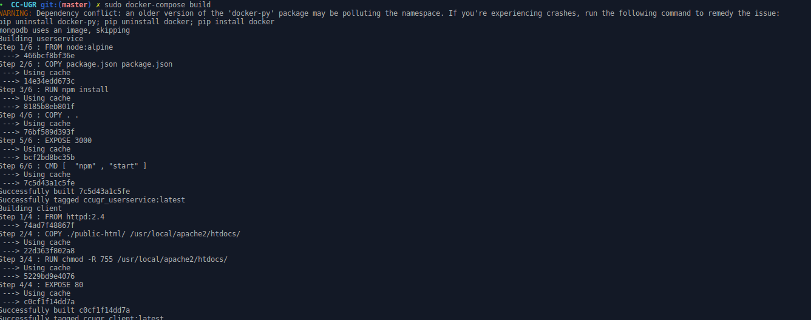
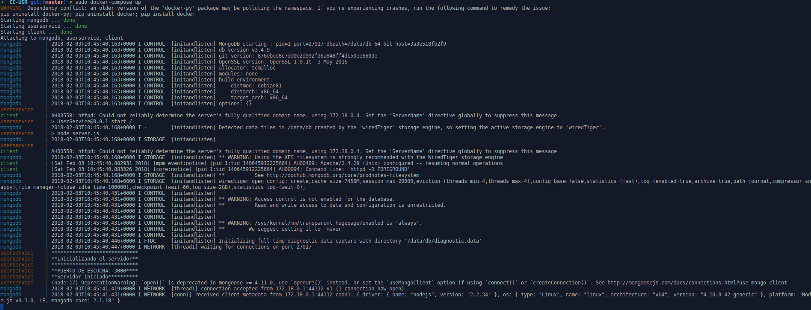
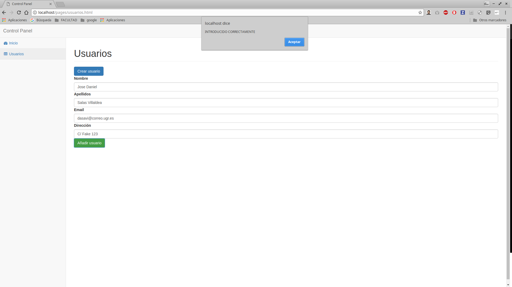
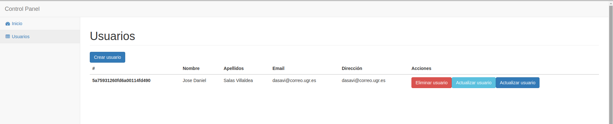
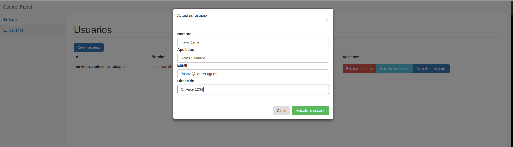
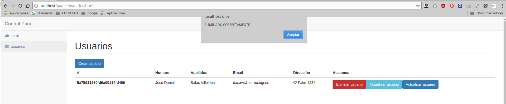
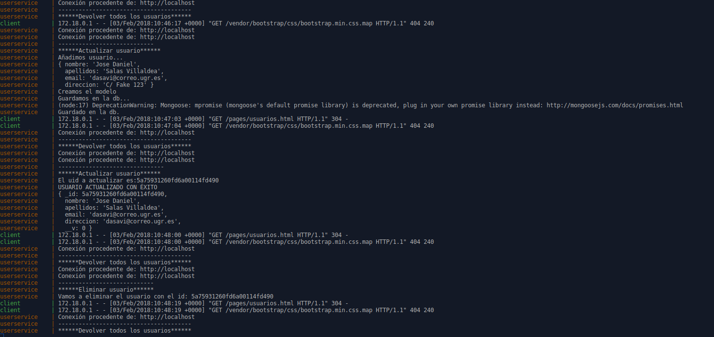

# Composición de contenedores Docker con DockerCompose

## Instalación de DockerCompose
Para instalar DockerCompose seguiremos los pasos de la página oficial de [Docker](https://docs.docker.com/compose/install/#install-compose)

## Ejecución.
Para ejecutar Docker Compose nos centraremos en 2 comandos principales:

```
docker-compose up

docker-compose build
```

El primero de todos si no se hizo un build anteriormente contruirá los contenedores y posteriormente los ejecutará. Sin embargo el segundo commando nos construye solamente los contenedores.


## Arquitectura

Se han realizado 3 contenedores: uno para el cliente utilizando la imagen *httpd:2.4*  que es una imagen muy liviana que nos ofrece un servidor Apache. Para el servicio de usuarios se ha utilizado una imagen *node:alpine* también muy liviana que nos incluye Nodejs y Npm. Por último se ha utilizado la imagen oficial de Mongodb para crear el contendor *mongo:latest*.

Para crear la arquitectura y conectar los contenedores crearemos un fichero docker-compose.yml en el que especificaremos las relaciones entre contenedores, los volúmenes y de donde contruiremos cada contenedor.

*NOTA*: No se ha podido hacer los links cliente/servidor ya que al no estar en el mismo entorno que los servicios no puede hacer uso de los links de Docker-Compose por lo que se añadió la ip de la máquina para comprobar que funcionara (en local se utilizó localhost).

## Servicios corriendo

Para ver que todo funciona correctamente ejecutaremos los comandos anteriormente vistos para crear y ejecutar los servicios:




Como podemos ver tenemos los 3 servicios corriendo correctamente y podemos ir viendo los logs de los servicios.

### Ejemplo uso servicios de los usuarios cliente / servidor

#### Crear usuario

#### Listar usuarios

#### Actualizar usuario

#### Eliminar usuario

#### Logs de la interacción cliente/servidor

