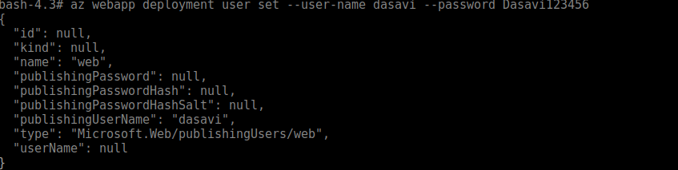
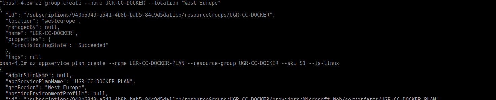
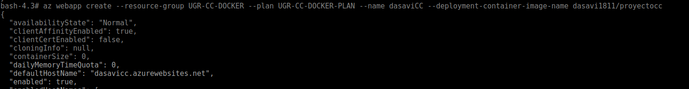
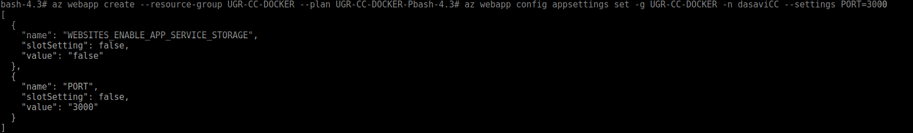
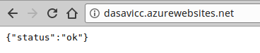

# Contenedores con Docker

## Instalación de Docker
Primero instalaremos mediante los repositorios de Ubuntu
```
sudo apt-get install docker docker.io
```
Una vez instalado elegiremos con qué imágen vamos a realizar el contenedor. En mi caso se ha utilizado Alpine con node ya que es una imagen muy liviana que tiene todo lo necesario para poder correr nuestra aplicación.

## Ejecución.
Primero tendrémos que crear nuestra pequeña apliación y posterior mente crear un DockerFile que le dirá a Docker que hacer para correr nuestra imagen.

Una vez que tengamos ya el DockerFile crearemos una imágen con Alpine de base y nuestra apliación ( se tiene que ejecutar en el directorio dónde esta el DockeFile):

```
sudo docker build -t nodetest .
```

Y cuando ya tengamos la imagen la podremos correr para ver si funciona correctamente:

```
sudo docker run --name testCC -p 3000:3000 nodetest
```
Aquí podremos especificar el nombre del contenedor que va a correr, el puerto en el que queremos que corra y la imagen que va a utilizar.

## Despliegue
Para poder desplegar el contenedor primero tendrémos que hacernos una cuenta en DockerHub ( para subir la imagen que estará ligada a un repositorio de github con el DockerFile y la apliación). Una vez que la tengamos nos crearemos un repositorio con Automated Build especificando el repositorio.

Una vez que tengamos creada la imagen en DockerHub toca desplegarla. En nuestro caso se ha utilizado Azure.
Primero crearemos un usuario para el despliegue:


Creamos un nuevo grupo y un plan, además de elegir que máquina utilizará ( la más barata en nuestro caso para hacer las pruebas):


Creamos la imagen desde nuestro repositorio de docker/hub especificando el grupo y el plan creado antes:


Por último especificamos que queremos abrir el puerto 3000 para que se pueda contactar con el servicio:


En esta última imagen podemos ver cómo llamando a dasavicc.azurewevsites.net nos devuelve un JSON con el status OK


