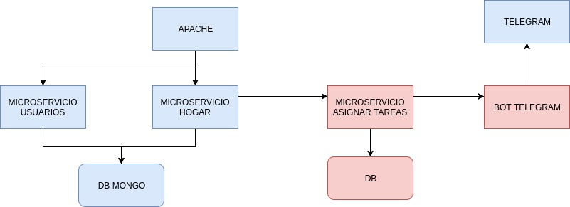

# CLOUD COMPUTING

## Descripción del problema
La gestión de tareas de un hogar a día de hoy se hace de forma manual asignando a los usuarios uno a uno las tareas que tiene que hacer y cuando tiene que hacerlas.
## Solución
Se propone un servicio que, a partir de los datos proporcionados por la API de del TFG del alumno, se genere un informe y una asignación automática de las tareas pendientes.
Estas tareas están organizadas por tipos de tareas los cuales solamente ciertos usuarios pueden realizar esos tipos. Además las tareas tendrán un peso y una importancia con lo que el sistema, a partir de esos parámetros y de la cantidad de tareas asignadas que tiene cada usuario podrá llevar una asignación equitativa.
Además se incluirá otro servicio de telegram que notifique cuando se asignen las tareas e información de las tareas asignadas a cada usuario.
## Arquitectura
Se utilizará una arquitectura basada en microservicios. Uno de los microservicios (el gestor de las tareas) estará desarrollado en perl y el microservicio para el bot de telegram estará desarrollado en nodejs.
Además, las tareas que han sido asignadas por el servicio se guardarán en la BD.

## Licencia
Proyecto bajo la licencia de Apache License
