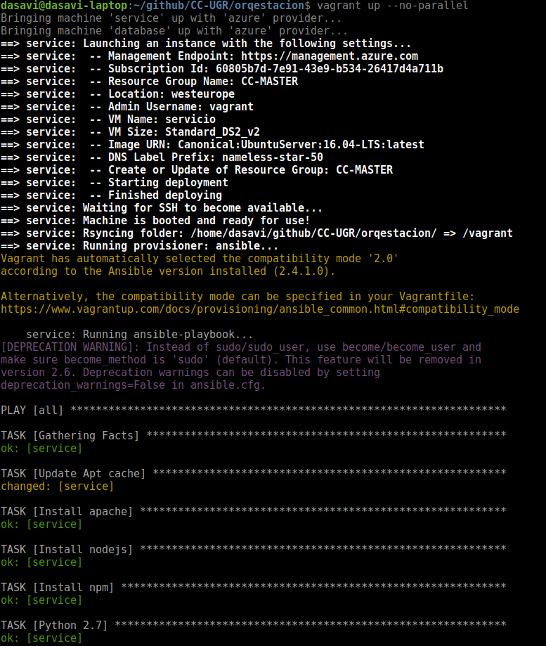
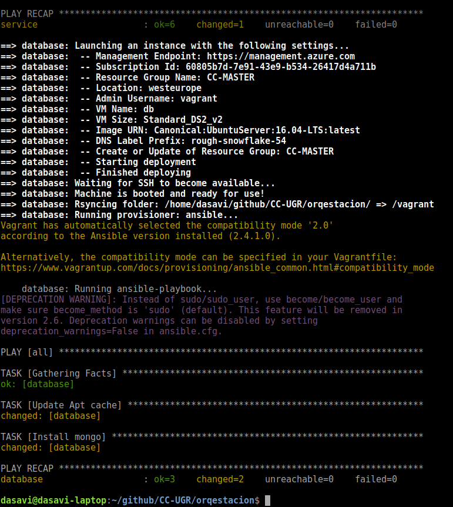

# Orquestación de máquians virtuales

## Instalación de Vagrant

Para instalar Vagrant solamente tenemos que irnos a la [página](https://www.vagrantup.com/downloads.html) de descargas , descargarnos el .deb ( si estamos en Debian/ Ubuntu) e instalarlo.
Posteriormente tendremos que instalarnos un plugin para que se comunique con Azure ya que será nuestro servicio elegido para desplegarlo en la nube. Para instalar el plugin solamente tendremos que hacer lo siguiente:
```
vagrant plugin install vagrant-azure --plugin-version '2.0.0.pre6'
```

## Ejecución.

Antes de nada necesitaremos las siguientes variables de entorno que nos da Azure:
```
AZURE_TENANT_ID
AZURE_CLIENT_ID
AZURE_CLIENT_SECRET
AZURE_SUBSCRIPTION_ID
```

Y una vez añadidas las variables de entorno solamente queda hacer un:
```
vagrant up --no-parallel
```


