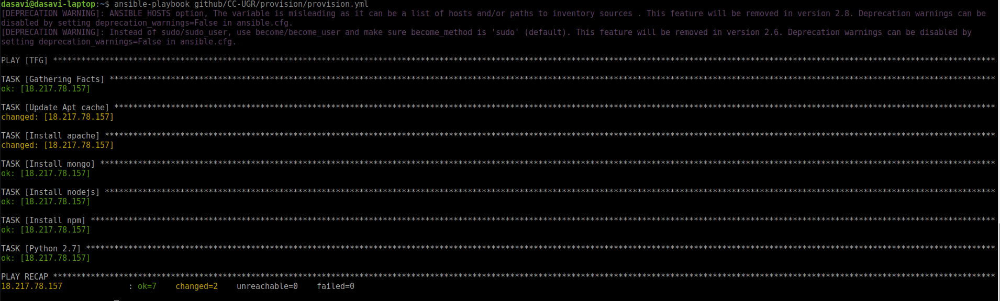

# Provisionamiento de servicios con Ansible

## Instalación de Ansible

Para instalar Ansible tenemos que previamente instalar Python.
```
sudo apt-get install python
```
Una vez instalado seguimos los pasos de la página oficial de Ansible: http://docs.ansible.com/ansible/latest/intro_installation.html#latest-releases-via-apt-ubuntu
```
 sudo apt-get update
 sudo apt-get install software-properties-common
 sudo apt-add-repository ppa:ansible/ansible
 sudo apt-get update
 sudo apt-get install ansible
 ```
## Configuración del archivo hosts
Ansible, para hacer referencias a nuestras máquinas lo hace mediante grupos de máquinas.Estos grupos se los especificamos en un archivo host con la siguiente estructura:
```
[NOMBREGRUPO]
IPDELSERVIDOR ansible_user=ubuntu ansible_python_interpreter=/usr/bin/python3
```
Se le especifica además para cada máquina con que usuario queremos que se conecte ansible y, si no está por defecto, el interprete de python que queremos usar.

## Resumen de los archivos de configuración.

Este [archivo](https://github.com/jdanielsv/CC-UGR/blob/master/provision/provision.yml) tiene la instalación de aquellas partes que se tendrán en nuestra máquina: Mongo, Node.JS, Apache2, Python2.7 y NPM

