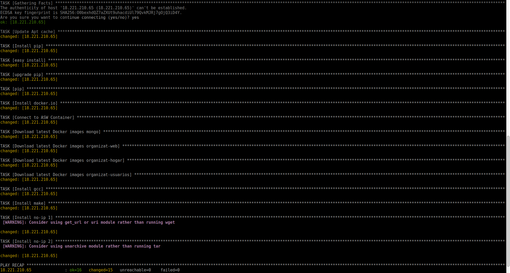
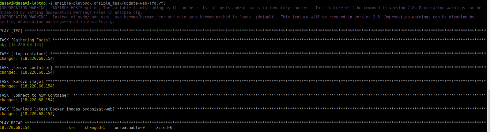
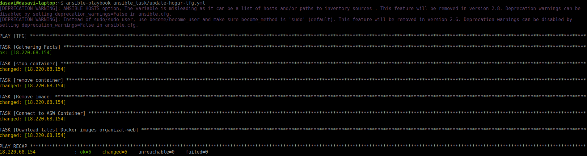
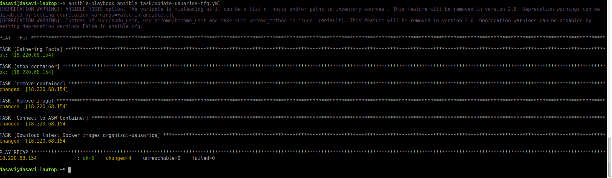
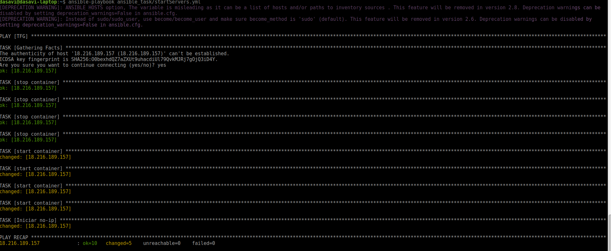

# Provisionamiento de servicios con Ansible

## Instalación de Ansible

Para instalar Ansible tenemos que previamente instalar Python.
```
sudo apt-get install python
```
Una vez instalado seguimos los pasos de la página oficial de Ansible: http://docs.ansible.com/ansible/latest/intro_installation.html#latest-releases-via-apt-ubuntu
```
 sudo apt-get update
 sudo apt-get install software-properties-common
 sudo apt-add-repository ppa:ansible/ansible
 sudo apt-get update
 sudo apt-get install ansible
 ```
## Configuración del archivo hosts
Ansible, para hacer referencias a nuestras máquinas lo hace mediante grupos de máquinas.Estos grupos se los especificamos en un archivo host con la siguiente estructura:
```
[NOMBREGRUPO]
IPDELSERVIDOR ansible_user=ubuntu ansible_python_interpreter=/usr/bin/python3
```
Se le especifica además para cada máquina con que usuario queremos que se conecte ansible y, si no está por defecto, el interprete de python que queremos usar.

## Resumen de los archivos de configuración.
**NOTA:** Para utilizar los archivos de configuración hay que configurar el login de docker con AWS y tener permisos para acceder a los contenedores alojados.
Tenemos 5 archivos principales:
### sites
El archivo sites tiene la configuración inicial para cada servidor: Instalación de pip para python, instalación de un plugin para pip (docker-py que nos servirá mas adelante), instalación de docker, descarga y ejecución de los distintos contenedores docker e instalación de no-ip para poder tener una dirección estática ya que cada vez que se apaga la máquina cambia la ip.

### update-*
Los archivos update-* son los encargados de descargar las últimas versiones de los contenedores y ejecutarlos. Previamente para las ejecuciones y elimina la imagen para no ir acumulándolas y gastar espacio. Se han hecho archivos separados ya que no siempre queremos actualizar todos los servicios.



### startServers
Si hubiera algún problema con los servidores, se reinicien o se paren los servicios este archivo parará todos los contenedores y los volverá a ejecutar. Además levanta el servicio de no-ip de nuevo.

